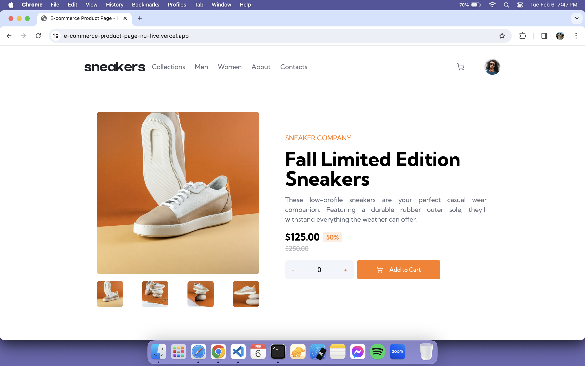
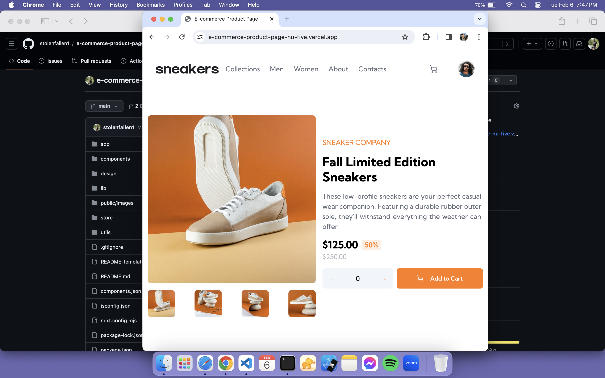
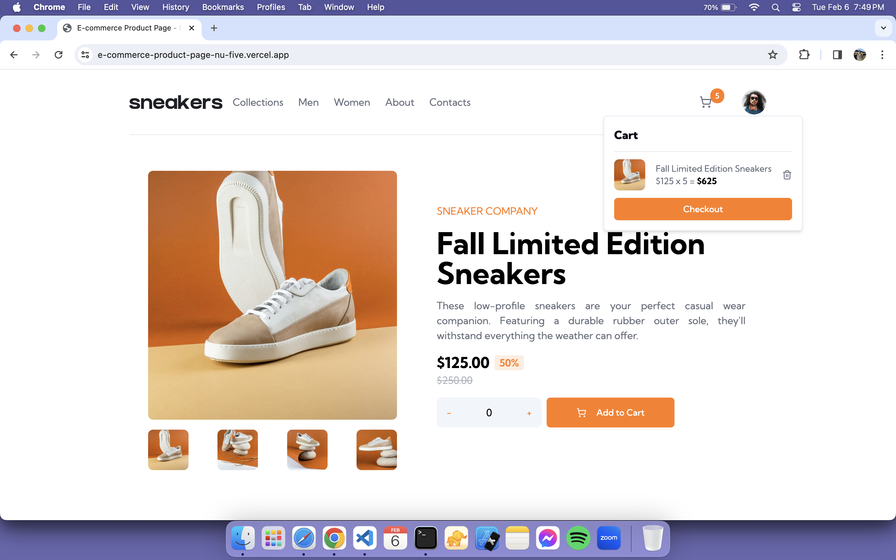
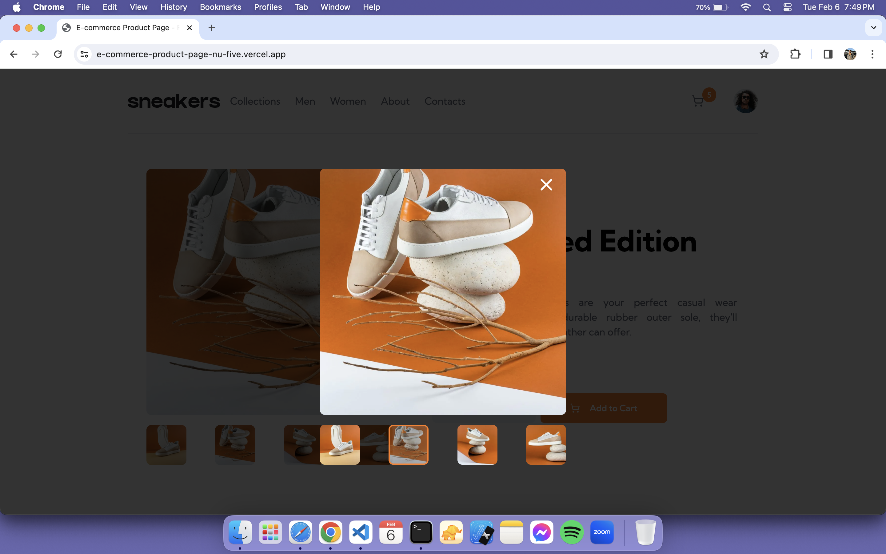
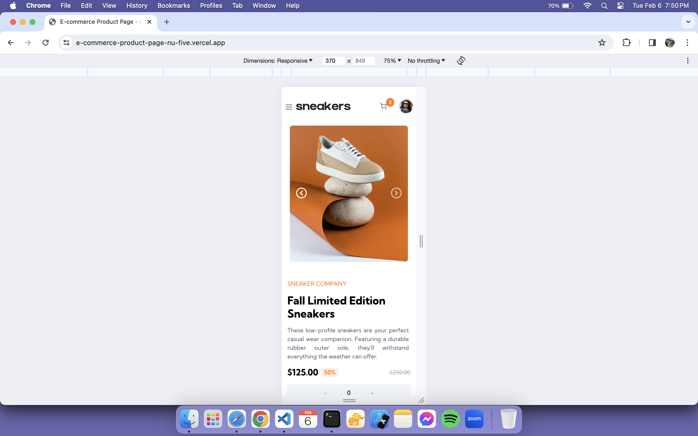
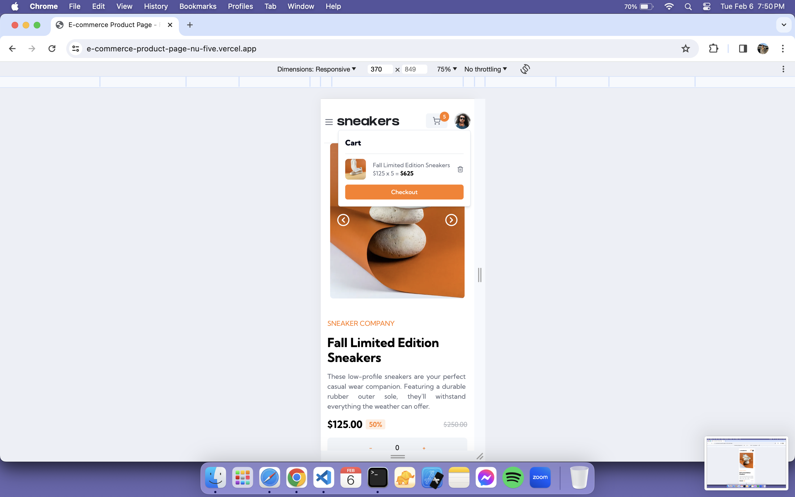
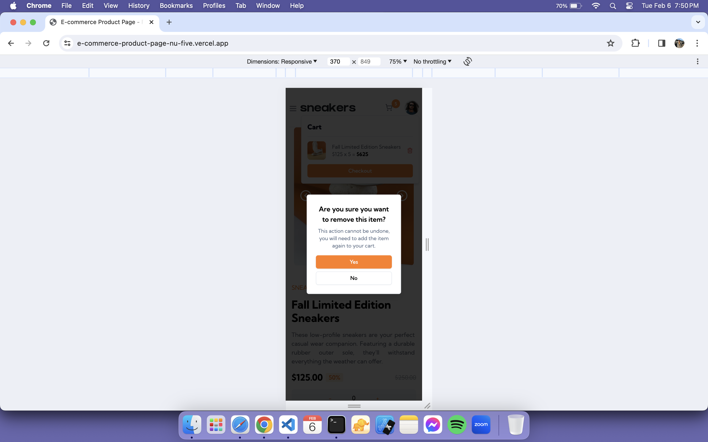

### The challenge

Users should be able to:

-   View the optimal layout for the site depending on their device's screen size
-   See hover states for all interactive elements on the page
-   Open a lightbox gallery by clicking on the large product image
-   Switch the large product image by clicking on the small thumbnail images
-   Add items to the cart
-   View the cart and remove items from it

### Screenshot

### Links

-   Solution URL: https://github.com/stolenfallen1/e-commerce-product-page
-   Live Site URL: https://e-commerce-product-page-nu-five.vercel.app/

### Built with

-   Semantic HTML5 markup
-   Tailwind
-   Shadcn-ui
-   Flexbox
-   NextJS
-   ReactJS
